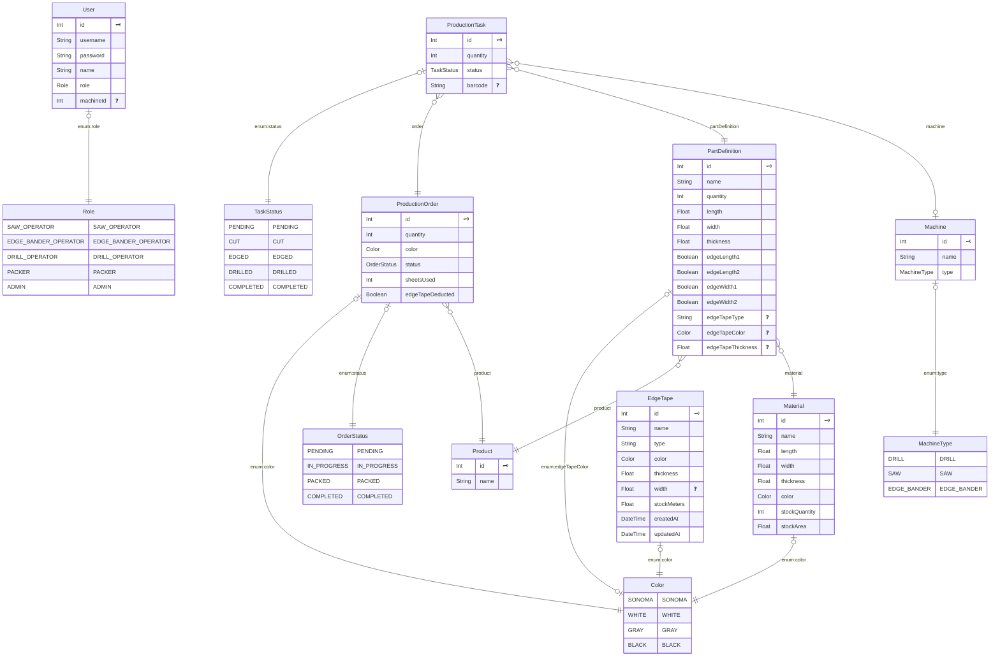

```mermaid
erDiagram

        OrderStatus {
            PENDING PENDING
IN_PROGRESS IN_PROGRESS
PACKED PACKED
COMPLETED COMPLETED
        }
    


        TaskStatus {
            PENDING PENDING
CUT CUT
EDGED EDGED
DRILLED DRILLED
COMPLETED COMPLETED
        }
    


        Color {
            SONOMA SONOMA
WHITE WHITE
GRAY GRAY
BLACK BLACK
        }
    


        Role {
            SAW_OPERATOR SAW_OPERATOR
EDGE_BANDER_OPERATOR EDGE_BANDER_OPERATOR
DRILL_OPERATOR DRILL_OPERATOR
PACKER PACKER
ADMIN ADMIN
        }
    


        MachineType {
            DRILL DRILL
SAW SAW
EDGE_BANDER EDGE_BANDER
        }
    
  "Material" {
    Int id "🗝️"
    String name 
    Float length 
    Float width 
    Float thickness 
    Color color 
    Int stockQuantity 
    Float stockArea 
    }
  

  "Product" {
    Int id "🗝️"
    String name 
    }
  

  "PartDefinition" {
    Int id "🗝️"
    String name 
    Int quantity 
    Float length 
    Float width 
    Float thickness 
    Boolean edgeLength1 
    Boolean edgeLength2 
    Boolean edgeWidth1 
    Boolean edgeWidth2 
    String edgeTapeType "❓"
    Color edgeTapeColor "❓"
    Float edgeTapeThickness "❓"
    }
  

  "Machine" {
    Int id "🗝️"
    String name 
    MachineType type 
    }
  

  "ProductionOrder" {
    Int id "🗝️"
    Int quantity 
    Color color 
    OrderStatus status 
    Int sheetsUsed 
    Boolean edgeTapeDeducted 
    }
  

  "EdgeTape" {
    Int id "🗝️"
    String name 
    String type 
    Color color 
    Float thickness 
    Float width "❓"
    Float stockMeters 
    DateTime createdAt 
    DateTime updatedAt 
    }
  

  "ProductionTask" {
    Int id "🗝️"
    Int quantity 
    TaskStatus status 
    String barcode "❓"
    }
  

  "User" {
    Int id "🗝️"
    String username 
    String password 
    String name 
    Role role 
    Int machineId "❓"
    }
  
    "Material" |o--|| "Color" : "enum:color"
    "PartDefinition" |o--|o "Color" : "enum:edgeTapeColor"
    "PartDefinition" }o--|| "Product" : "product"
    "PartDefinition" }o--|| "Material" : "material"
    "Machine" |o--|| "MachineType" : "enum:type"
    "ProductionOrder" |o--|| "Color" : "enum:color"
    "ProductionOrder" |o--|| "OrderStatus" : "enum:status"
    "ProductionOrder" }o--|| "Product" : "product"
    "EdgeTape" |o--|| "Color" : "enum:color"
    "ProductionTask" |o--|| "TaskStatus" : "enum:status"
    "ProductionTask" }o--|| "ProductionOrder" : "order"
    "ProductionTask" }o--|| "PartDefinition" : "partDefinition"
    "ProductionTask" }o--|o "Machine" : "machine"
    "User" |o--|| "Role" : "enum:role"
```
